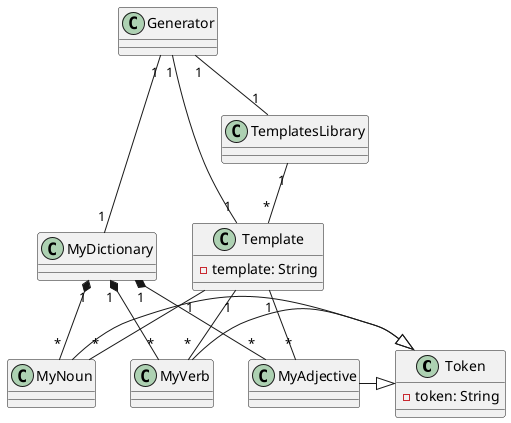
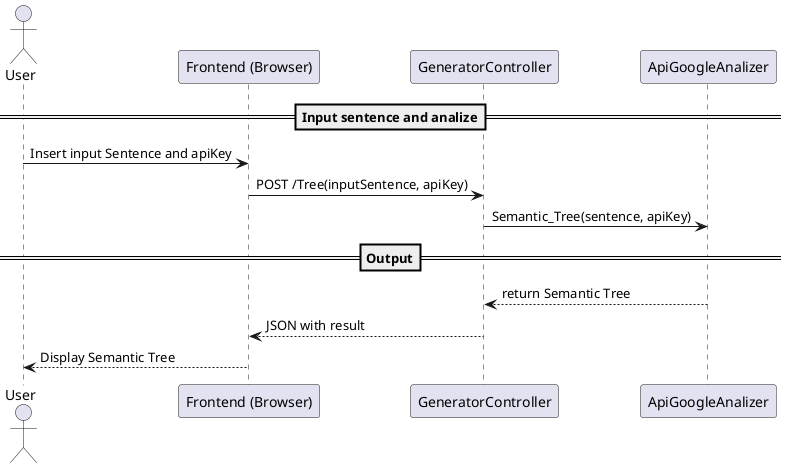
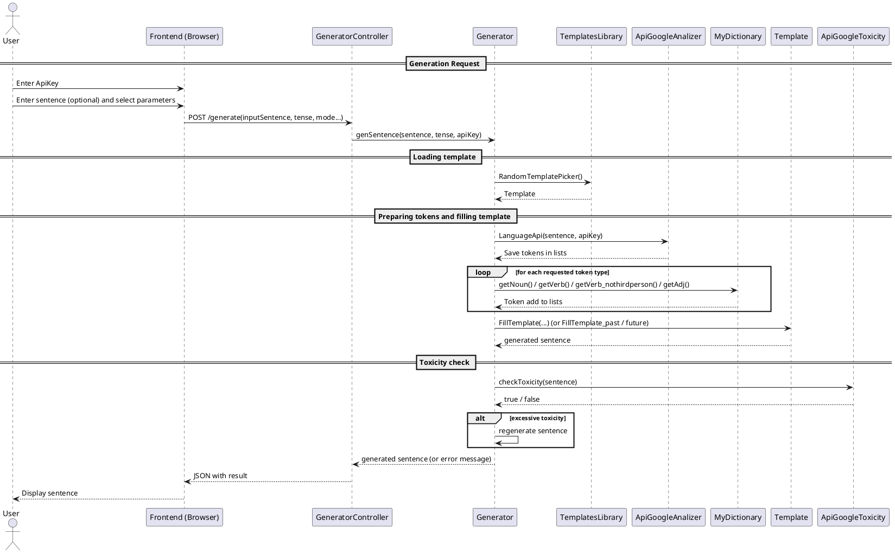

# Design Document

## 1. Introduction

### Project purpose
The "Nosense Generator" aims to analyze and generate nonsense sentences in English. It includes functionalities for syntactic analysis via Google NLP API, phrase generation using templates and word dictionaries, and options to expand and manage linguistic structures.

### Scope
The application is written in Java, modular, and uses external APIs and resource files to create fun and nonsensical sentences.

---

## 2. Domain Model

### Main Entities

- **Token**: Base class representing a generic token or word.
- **MyNoun**: Subclass of Token representing a noun.
- **MyVerb**: Subclass of Token representing a verb.
- **MyAdjective**: Subclass of Token representing an adjective.
- **MyDictionary**: Storage of words categorized by type; provides random words.
- **Template**: Blueprint for sentence structure, using various words.
- **TemplatesLibrary**: Collection of multiple templates.
- **Generator**: Orchestrates the process of generating sentences using dictionary and templates.

### Relationships

- **MyNoun**, **MyVerb**, and **MyAdjective** are subclasses of **Token**.
- **MyDictionary** contains multiple **MyNoun**, **MyVerb**, and **MyAdjective** instances.
- **Template** uses multiple **MyNoun**, **MyVerb**, and **MyAdjective** to fill placeholders.
- **TemplatesLibrary** contains multiple **Template** objects.
- **Generator** uses **MyDictionary**, **TemplatesLibrary**, and a **Template** to generate sentences or linguistic structures.



---

## 3. Sequence Diagrams

### Sentence analysis
1. User inputs a sentence
2. System sends sentence to Google NLP API
3. Receives syntactic analysis
4. Displays results to the user



### Sentence generation
1. User selects a template
2. System fetches random words from dictionaries
3. Constructs and displays the sentence



---

## 4. Main Class Design
### Folder structure
```plaintext  
src/  
├── main/  
│   ├── java/  
│   │   └── NoSenGen/  
│   │       ├── api/  
│   │       │   ├── GoogleLanguageAPI  
│   │       │   ├── GoogleToxicityAPI  
│   │       ├── controller/  
│   │       │   └── GeneratorController  
│   │       ├── generator/  
│   │       │   └── Generator  
│   │       ├── myDictionary/  
│   │       │   ├── MyAdjective  
│   │       │   ├── MyDictionary  
│   │       │   ├── MyNoun  
│   │       │   ├── MyVerb  
│   │       │   └── Token  
│   │       ├── template/  
│   │       │   ├── Template  
│   │       │   └── TemplatesLibrary  
│   │       └── Main
```
### Main methods and constructors

#### NoSenGen folder
Main
```java
//To run the server
public ApplicationRunner applicationRunner();

//To run SpringBoot
public static void main(String[] args);
```

#### Api folder
Google Language API
```java
public class GoogleLanguageAPI {
    //To analize sentence and save tokens in lists
    public static void LanguageApi(String sentence, String apiKey) throws Exception;

    //To analize sentence and return the Semantic Tree
    public static String Semantic_Tree(String sentence, String apiKey) throws Exception;

    //Call api and return analized sentence
    private static String CallAPI(String sentence, String apiKey) throws Exception;

    //Getter
    public static ArrayList<MyNoun> getNouns();
    public static ArrayList<MyVerb> getVerbs();
    public static ArrayList<MyVerb> getVerbs_thirdperson();
    public static ArrayList<MyVerb> getVerbs_past();
    public static ArrayList<MyAdjective> getAdj();
}
```
Google Toxicity API
```java
public class GoogleToxicityAPI {
    //Analize if sentence is accetable or Toxic
    public static boolean isToxicityAcceptable(String sentence, String apiKey) throws Exception;
}
```
#### Controller folder
GeneratorController
```java
public class GeneratorController {
    //Builder
    public GeneratorController(Generator generator);
    
    //Handle HTTP GET requests to the root URL, sets a maximum sentence limit in the model, and returns the "index" view for display
    public String showHomePage(Model model);

    //Analize input sentence and generate new ones
    public GeneratorResponse generateSentences;

    //Analize input sentence and return Semantic Tree
    public ResponseEntity<Map<String, String>> semanticTree;

    //Save apiKey
    public ResponseEntity<String> apiKeyfunction(@RequestParam String apiKey);

    //Internal class
    public static class GeneratorResponse {
        //Getter
        public List<String> getPastSentences();
        public List<String> getPresentSentences();
        public List<String> getFutureSentences();

        //Setter
        public void setError(boolean b);
        public void setMessage(String s);
        
    }
}
```
#### Generator folder
Generator
```java
public class Generator {
    //Builder
    public Generator();

    //Analize the sentence with API
    private void analyzeSentence(String sentenceIn, String apiKey);

    //Create random sentences
    public String genSentence(String sentenceIn, int tense, String apiKey) throws IOException;
}
```
#### MyDictionary folder
MyAdjective 
```java
public class MyAdjective extends Token {
    //Builder
    public MyAdjective (String a);
    // GET
    public String getAdj();
    // SET
    public void setAdj(String n);
}

```

MyDictionary
```java
public class MyDictionary {
    //Builder
    public MyDictionary() throws IOException;

    //Reads the file line by line and transforms each line into an object of type "T" using a 'creator' function and returns the list of objects
    private static <T> List<T> setList(String fileName, Function<String, T> creator) throws IOException;

    //Getter
    public MyNoun getNoun();
    public MyVerb getVerb();
    public MyVerb getVerb_nothirdperson();
    public MyVerb getVerb_past();
    public MyAdjective getAdj();
    
    //Choose a random Token
    private <T> T chooseToken(List<T> l);

    //DEBUG
    private static <T> void printList(List<T> list);
    
}
```

MyNoun
```java
public class MyNoun extends Token{
    //Builder
    public MyNoun(String n);
    //GET
    public String getMyNoun();
    //SET
    public void setMyNoun(String n);
}
```

MyVerb
```java
public class MyVerb extends Token {
    //Builder
    public MyVerb (String v);
    //GET
    public String getMyVerb();
    //SET
    public void setMyVerb(String n);
}
```

Token
```java
public class Token {
    //Builders
    public Token(String s);
    public Token();
    //GET
    public String getToken();
    //SET
    public void setToken(String t);
    //toString
    public String toString();
}
```

#### Template folder
Template
```java
public class Template {
    //Builder
    public Template(String t);

    //Private method that counts how many nouns/adjectives/verbs/sentences are in the template
    private int CountTokens(String target, String sentence);

    //Method that fills the template
    public String FillTemplate(List<MyNoun> nouns, List<MyVerb> verbs, List<MyVerb> verbs_nothirdperson, List<MyAdjective> adjectives);

    //Fill the template with past verbs (does not have third person control)
    public String FillTemplate_past(List<MyNoun> nouns, List<MyVerb> verbs, List<MyAdjective> adjectives);

    //Fill the template with future verbs (does not have third person control)
    public String FillTemplate_future(List<MyNoun> nouns, List<MyVerb> verbs, List<MyAdjective> adjectives);

    //Getter
    public String getTemplate();
    public int getMissingVerbs();
    public int getMissingNouns();
    public int getMissingAdjectives();

    //Checks if the given text contains the exact phrase provided
    private boolean containsExactPhrase(String text, String phrase);
    
}
```

TemplatesLibrary
```java
//This class create Template objects
public class TemplatesLibrary{
    //Take templates from a .txt and create objects using TemplateAdder
    static

    //Use a fileReader and create the objects
    private static ArrayList<Template> TemplateAdder(String filenoun);
    
    //Pick a random template
    public static Template RandomTemplatePicker();

    //DEBUG Pick a random template from first 10
    public static Template RandomTemplatePicker_nosentence();
}
```

---

## 5. Class Diagram

```plantuml
@startuml ClassDiagram

' !include Graphic.puml

package NoSenGen {
    package generator {
        class Generator {
            - List<MyNoun> nounList
            - List<MyAdjective> adjList
            - List<MyVerb> verbList
            - List<MyVerb> verbList_nothirdperson
            - List<MyVerb> verbList_past
            - boolean firstSentence
            + Generator()
            + String genSentence(String sentenceIn, int tense)
            - void analyzeSentence(String sentenceIn)
            - static <T> void fillList(List<T> list, int targetSize, Supplier<T> sup)
            + static <T> void stampaLista(List<T> lista)
        }
    }

    package myDictionary {
        class Token {
            - String token
            + Token()
            + Token(String s)
            + String getToken()
            + void setToken(String t)
            + String toString()
        }

        class MyNoun {
            + MyNoun(String n)
            + String getMyNoun()
            + void setMyNoun(String n)
        }

        class MyAdjective {
            + MyAdjective(String a)
            + String getAdj()
            + void setAdj(String n)
        }

        class MyVerb {
            + MyVerb(String v)
            + String getMyVerb()
            + void setMyVerb(String n)
        }

        class MyDictionary {
            - List<MyNoun> nouns
            - List<MyVerb> verbs
            - List<MyVerb> verbs_nothirdperson
            - List<MyVerb> verbs_past
            - List<MyAdjective> adjs
            + MyDictionary()
            + MyNoun getNoun()
            + MyVerb getVerb()
            + MyVerb getVerb_nothirdperson()
            + MyVerb getVerb_past()
            + MyAdjective getAdj()
            - <T> T chooseToken(List<T> l)
        }
    }

    package template {
        class Template {
            - String template
            - int nounsNumber
            - int verbsNumber
            - int adjNumber
            - int sentenceNumber
            - boolean nothirdperson
            - List<String> nothirdpersontoken
            + Template(String t)
            + String FillTemplate(List<MyNoun>, List<MyVerb>, List<MyVerb>, List<MyAdjective>)
            + String FillTemplate_past(List<MyNoun>, List<MyVerb>, List<MyAdjective>)
            + String FillTemplate_future(List<MyNoun>, List<MyVerb>, List<MyAdjective>)
            + String getTemplate()
            + int getMissingVerbs()
            + int getMissingNouns()
            + int getMissingAdjectives()
            - int CountTokens(String target, String sentence)
            - boolean containsExactPhrase(String text, String phrase)
        }

        class TemplatesLibrary {
            - static ArrayList<Template> templates
            - static ArrayList<Template> TemplateAdder(String filenoun)
            + static Template RandomTemplatePicker()
            + static Template RandomTemplatePicker_nosentence()
            {static}
        }
    }

    package api {
        class GoogleLanguageAPI
        class GoogleToxicityAPI
    }

    package controller {
        class GeneratorController {
            - Generator generator
            + GeneratorController(Generator generator)
            + String showHomePage(Model model)
            + GeneratorResponse generateSentences(String inputSentence, int mode, int totalSentences, int pastSentences, int presentSentences, int futureSentences)
            + ResponseEntity<Map<String, String>> semanticTree(String inputSentence)

            class GeneratorResponse {
                - List<String> pastSentences
                - List<String> presentSentences
                - List<String> futureSentences
                + List<String> getPastSentences()
                + List<String> getPresentSentences()
                + List<String> getFutureSentences()
            }
        }
    }

    class Application {
        + static void main(String[] args)
    }

    Application --> controller.GeneratorController
    generator.Generator --> myDictionary.MyDictionary
    generator.Generator --> template.Template
    myDictionary.MyNoun --|> myDictionary.Token
    myDictionary.MyAdjective --|> myDictionary.Token
    myDictionary.MyVerb --|> myDictionary.Token
    template.Template --> myDictionary.MyNoun
    template.Template --> myDictionary.MyVerb
    template.Template --> myDictionary.MyAdjective
    template.TemplatesLibrary --> template.Template
    controller.GeneratorController --> generator.Generator
    controller.GeneratorController --> api.GoogleLanguageAPI
}

@enduml

```


## 6. Internal Sequence Diagrams

```plantuml

```

---

## 7. Technical notes
- The system uses Google Natural Language API for syntactic analysis
- Word lists are loaded from .txt files
- Sentence generation uses predefined patterns and random words
- Need an APiKey active

---

## 8. Final considerations
- Modularity and scalability: easy to extend with new templates and languages
- Easily customizable via configuration and dictionaries
- The architecture supports future API integrations and features

---

## Appendix: Recommended tools
- **PlantUML** for UML diagrams
- **Java** IDE: IntelliJ IDEA
- **Resource files**: JSON, txt, .png, .css, .js
- **Spring Boot** for REST API
- **Maven** for dependency management
- **Git** for version control
- **GitHub** for hosting
- **Heroku** for deployment
- **Postman** for API testing
- **Google Cloud Platform** for hosting
- **Google Cloud Storage** for file storage
- **Google Cloud Firestore** for database
- **Google NLP API** for linguistic analysis

---
